# Completion Email Review

**Date:** 3 October 2026
**Scope:** the whole completion email feature (called "shared alerts" in the code): the app screens, the five Supabase functions, the database tables, the emails themselves, and the web pages the links open.
**Nothing has been deployed, no migration has been applied, and no email was sent.** I only read production metadata and row counts: there are 0 contacts, 0 invites and 0 sent emails, so nobody has been affected yet.

## Verdict

**Not safe to launch as it is live today. It is safe once this branch is deployed.**

The idea is sound: invite first, nothing sent without consent, stop and block links in every email. But I found one critical hole and several serious ones:

1. **Critical: any Premium user could email any stranger, without consent, as often as they liked.** The database let the app write directly to the contacts table. A Premium user with basic tools could mark their own contact as "accepted", or change an accepted contact's address to someone else's, and then trigger completion emails with any text they chose. Invites, blocks and limits were all bypassed. Migration 020 removes that write access. This is the most important fix on the branch.
2. **The invite limit didn't work.** Pressing "Resend invite" reused the same database row, so the "10 a day" counter never went up. One person could be sent unlimited invite emails.
3. **The emails never said who they were from** ("Someone has added this email address…"). A recipient couldn't make an informed choice, "Block this sender" didn't say who the sender was, and anonymous emails look like phishing to spam filters.
4. **The safer link pages in the repo would have shown raw HTML.** Hosted Supabase turns HTML from functions into plain text, so the "confirm before acting" page would have looked broken. The live version is worse: one click, or a mail scanner opening the link, accepts or blocks straight away.
5. **The app hid every server error behind "Could not update shared notification."** For example, it never showed "Too many invites today". The sender also never learned whether a completion email went out.

After the fixes, I'm comfortable with this as a reassurance feature. It's consent-based, rate-limited, every email can be stopped in one click, and the emails are honest about what they are.

## What the recipient sees

**Invitation.** It names the sender, says exactly what the emails will show, and nothing happens until they press a button on the confirm page.

| Before | After (phone) | After (desktop) |
|---|---|---|
| 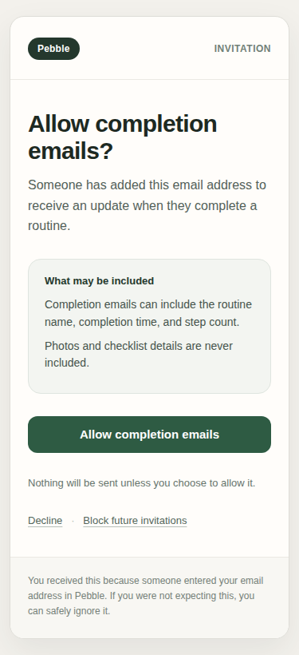 | 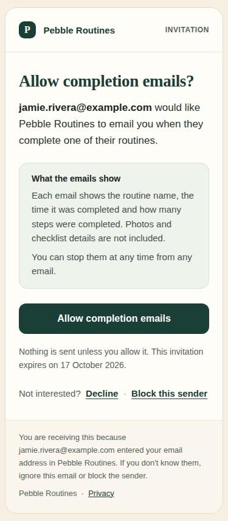 | 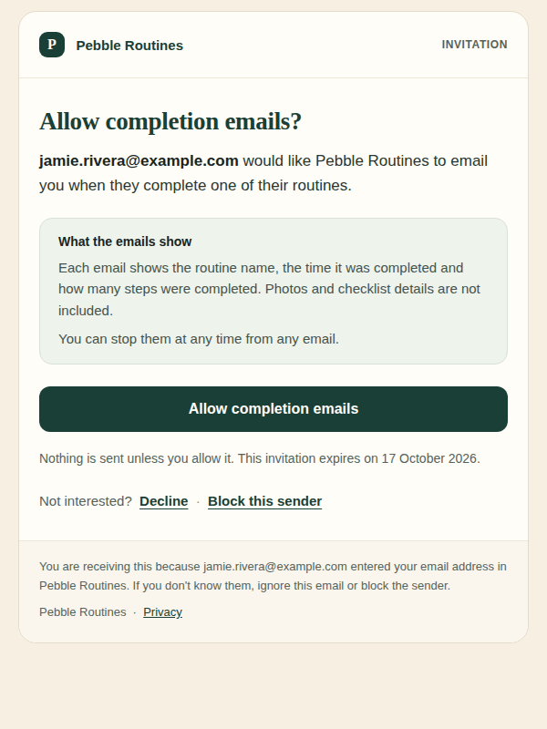 |

**Completion email.** It shows the sender, the routine, the time in the sender's own time zone with the offset, and the steps. It says plainly that it was sent automatically when the routine was marked complete in the app, which is a status update rather than a live check. Stop and Block links are at the bottom. The subject is always "Routine completed · Pebble", so a routine name never shows on a lock screen.

| Before | After | Dark mode | Hostile title, escaped | Name hidden, address footer |
|---|---|---|---|---|
| 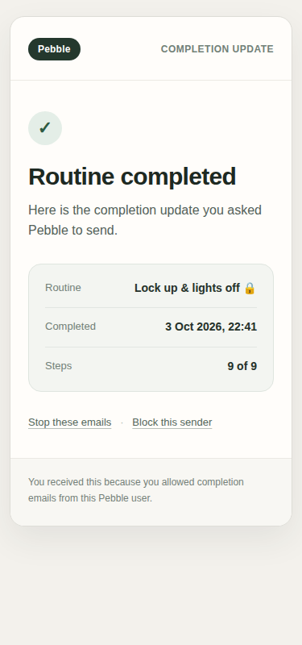 | 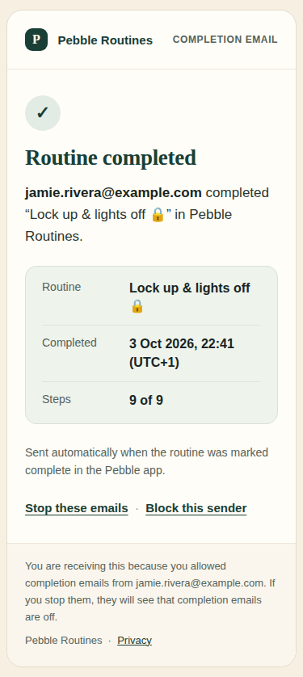 | 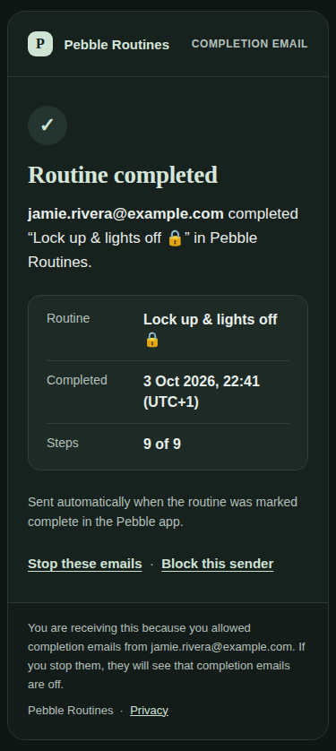 | 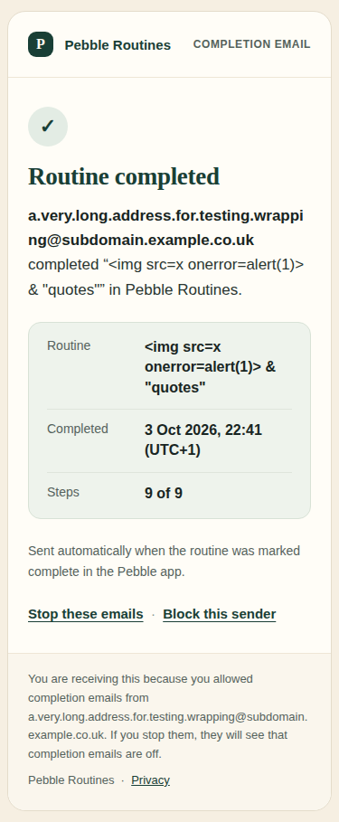 | 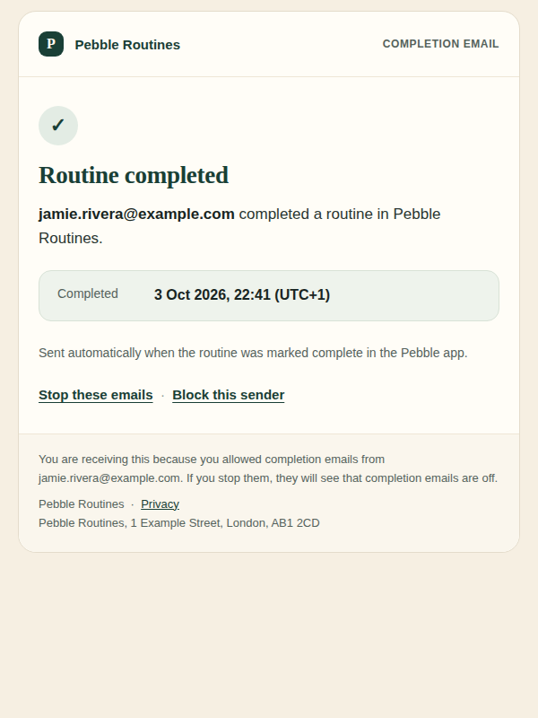 |

**The pages the links open** are on pebbleroutines.com. Opening a link changes nothing. The person confirms with one button, and Block can also stop invitations from everyone using Pebble.

| Allow | Block | After "Stop" |
|---|---|---|
| 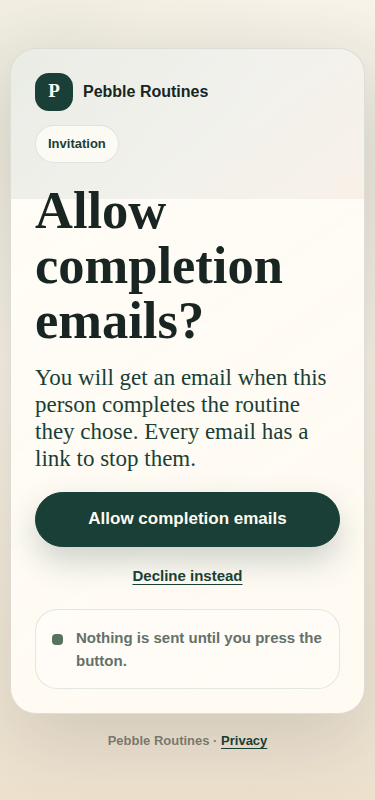 | 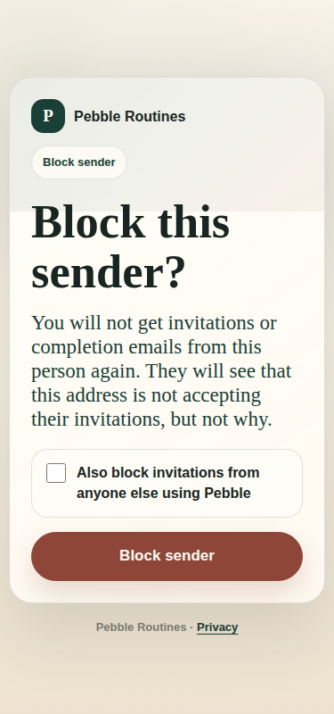 | 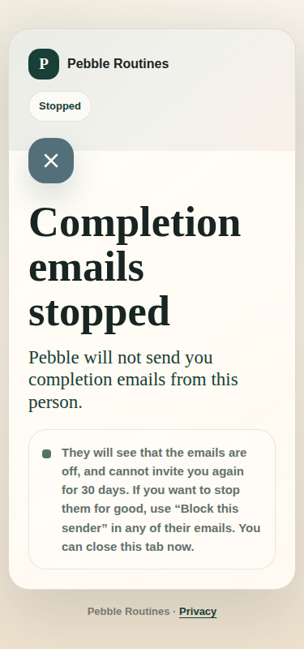 |

Every template was rendered at 600px and 375px, in light and dark, with a long title, emoji and ` & "quotes"`. Nothing overflowed and nothing ran as code. The full set is in the scratchpad (`email_review/after_png`, `web_png`, `app_png`).

## Sender journey (in the app)

| Step | What happens now |
|---|---|
| Discover | The Email page has three plain points: what it does, that it's the contact's choice, and what's included. "Effortless reassurance", "colleague" and "log of your consistency" are gone (`COPY_GUIDELINES.md`). |
| Free vs Premium | Free users see "View Premium". Premium is checked on the server for inviting and for every send. Turning emails off and removing a contact no longer need Premium. |
| Add contact | The sheet says who to add ("someone who knows you and expects these emails") and that the emails will show your account email. |
| Pending | "Nothing is sent until they accept. The invite expires after 14 days." (Before, it wrongly said "Pebble will email this contact".) |
| Accepted | An on/off switch, plus a new **"Show the routine name"** switch for personal titles such as medication. The privacy policy already promised this, but there was no switch in the app. |
| Declined or blocked | Neutral wording ("They declined", "Not accepting invites"), not red error styling. The real server reason now shows, for example "You can invite this address again from 2 November 2026". |
| Completion | The completion screen shows "Completion email sent to sam@…", or why it wasn't sent (no connection, or the hourly limit). A failed send is retried once. |
| Remove contact | Stops everything. The pending invite link stops working too. |
| Account deletion | All contacts, invites, blocks and the log are deleted with the account (database cascade). A recipient's "block everyone" opt-out is kept as a hash. |
| Premium ends | Nothing is sent (`noActiveEntitlement`). The contact stays, and emails resume if Premium comes back. The recipient can still stop or block at any time. |

| Pending | Accepted | Emails off, name hidden | Invite sheet | Completion screen |
|---|---|---|---|---|
| 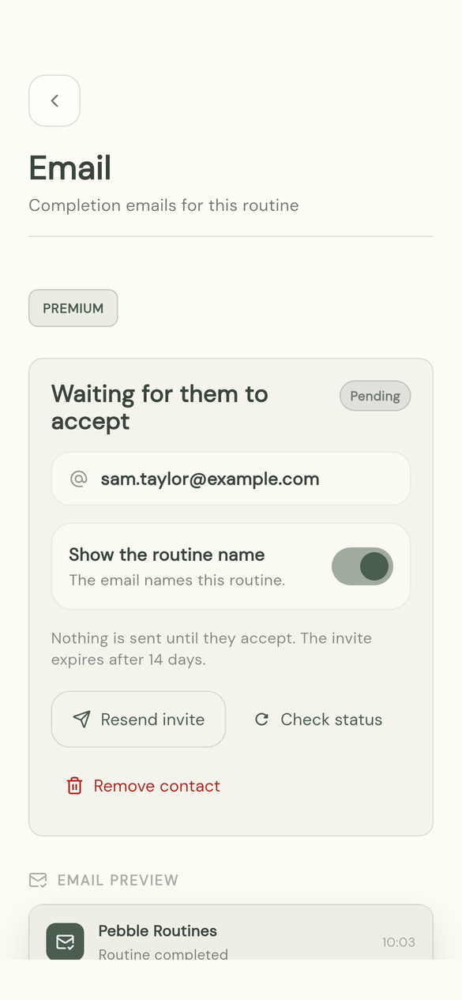 | 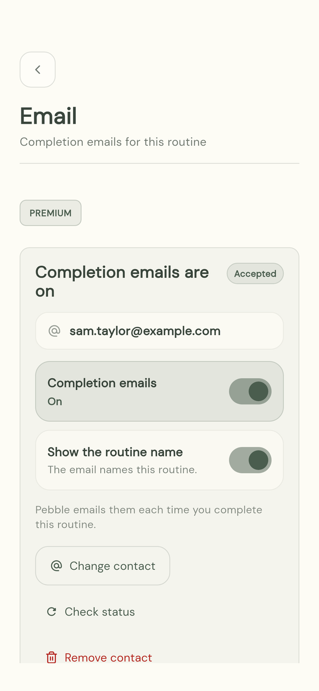 | 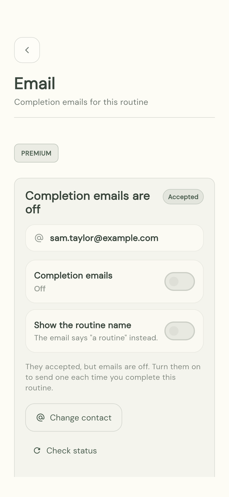 | 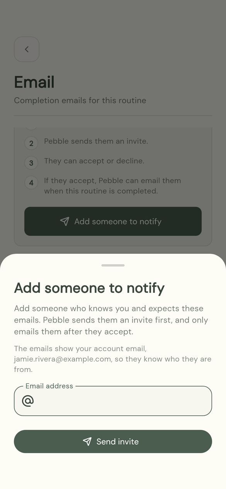 | 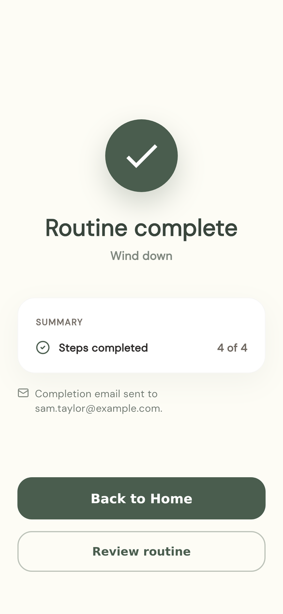 |

I also removed the red "Clear all reminders" bin from the Email page. On that page it would have deleted the routine's *reminders*.

## Recipient journey

1. **Invite:** names the sender, says what the emails include, and gives the expiry date. The links are Allow, Decline and Block this sender.
2. **Allow / Decline / Block:** a page on the Pebble site, where pressing the button is what acts. Block has an option for "anyone else using Pebble".
3. **Completion emails:** every one has Stop and Block links, plus a one-click **Unsubscribe** that Gmail, Yahoo and Apple Mail show at the top.
4. **Stopping for good:** Stop means the sender can't re-invite for 30 days. Block means never from that sender. Block with "everyone" means no Pebble invitation ever reaches that address. If a link doesn't work, the problem page gives the privacy inbox.

## Abuse & security

| Risk | Status before | Fix |
|---|---|---|
| Sender forges consent through the REST API (sets status to accepted, or swaps the address) | **Open in production** | Migration 020 revokes the app's write access to all `shared_alert_*` tables. Only the functions (service role) can write. |
| Unlimited invite emails to one person | **Open** (resend reused the row) | Counted per invite email: 10 per sender per day, 3 per sender per address per week, 5 per address per day across all senders, 20 active contacts. |
| Re-invite straight after a decline | Allowed | 30-day cooldown per sender and address. It survives removing and re-adding the contact. |
| Block not global | Per sender only, and lost if the sender deleted their account | Per-sender block, plus an optional global opt-out (hash only) that no account deletion removes. Both are checked again at send time. |
| Completing a routine 100 times | 100 emails (any new run id) | Per contact: 3 an hour and 12 a day. Further sends are logged as skipped and the app says so. Each run is emailed at most once. |
| Premium bypass | Checked server-side | Still checked server-side, and RLS write access is now gone. |
| Mail scanners clicking links | **Live code acts on GET** | GET never acts. It redirects to the static confirm page, and only POST acts. |
| Token strength and storage | 2×UUIDv4 (~244 bits), SHA-256 stored | 256-bit random tokens. Only the hash is stored. |
| Tokens in logs | In query strings, so in edge logs | The links put the token in the URL **fragment**, which browsers never send to a server. Only the one-click unsubscribe URL keeps it in the query, because RFC 8058 requires that. |
| Old or stale links | Any token could accept, including links in completion emails and invites sent to a previous address | Allow needs an unexpired *invitation* token sent to the contact's *current* address. Newer invites supersede older ones. |
| Expiry | Invites 14 days (the policy said 90), completion links 90 days | The same. The policy now matches. Stop and Block still work after expiry until the token is pruned. |
| CSRF on POST | Needs the secret token | Unchanged. An attacker can't act without the token. |
| Open redirect | Fixed targets | Fixed targets on pebbleroutines.com only. |
| HTML injection (title, name, email) | Escaped (`'` was not) | Everything is escaped, including `'`. Control and bidi-override characters are stripped. Titles are capped at 120 characters. The subject has no user text. |
| Header or recipient injection | Loose regex allowed `Name<a@b>` | Strict address check (no `<>,;"`, spaces or control characters). Tests cover `\r\nBcc:`. |
| Sender-written spam in invites to strangers | — | Invites contain no text the sender wrote: only their verified account email. |
| Sensitive routine titles | Always sent and always stored | The sender can hide the name. If hidden, it's neither sent nor stored. The subject is always generic. |
| Sender email exposure | Not shown | Shown on purpose, so the recipient knows who it is. The app tells the sender before they invite. Apple "Hide my email" users show as their relay address. |
| Log retention | Kept forever | A daily job (02:40 UTC) deletes the sent log after 90 days, tokens 7 days after expiry, finished cooldowns, and removed or declined contacts after 90 days. |
| Provider errors leaking | Raw Resend text went to the app and was stored in full | Redacted summaries only (no addresses or tokens). The app gets a plain message. |
| Double sends | Unique (contact, run) | Same, plus a Resend `Idempotency-Key`, so a network retry can't send twice. |
| Wrong time in the email | UTC with no label (an hour out in UK summer for some builds) | The app sends UTC plus its offset, and the email shows "22:41 (UTC+1)". Older builds still show correctly. |

## What I fixed

- **Database:** migration `020_completion_email_hardening.sql`. It revokes the app's writes, adds token purpose and recipient, a decline cooldown, the global opt-out table, a retry counter, size checks, and the daily retention job.
- **Functions:** all five rewritten around shared, tested modules in `supabase/functions/_shared/shared_alert_*.ts`: policy, email templates, store, links and runtime. There are 25 new Deno tests, covering the whole invite → accept → send → stop/block flow against an in-memory database. All 65 function tests pass.
- **Emails:** new templates in the Pebble brand (cream and forest green, serif heading), mobile-first, dark mode, plain-text part, `List-Unsubscribe` and `List-Unsubscribe-Post` (one-click), `Auto-Submitted`, `lang="en-GB"`, an optional postal-address footer and a privacy link.
- **Web:** a new `web/shared-alert/confirm/` page. The result pages are reworded. The blocked page had falsely said the sender is not told.
- **App:** server messages now reach the user; there's a "Show the routine name" switch; the completion screen says whether the email was sent; each contact state has accurate wording; the email preview matches the real email ("Pebble Verification" and "Verified & Complete" are gone); and one retry. `flutter analyze` is clean and all 296 tests pass. The walkthrough harness now captures every contact state, the invite sheet and the completion screen with an email note.
- **Docs:** `web/privacy.html` covers what the emails show, the 30-day cooldown, the global opt-out and the 90-day log. `LEGAL_PROCESSOR_MAP.md` lists what Resend receives.

## What needs the owner

1. **Domain and DNS (required before real users).** Choose the sending domain first (`START_HERE.md` to-do 1). Then, in Resend → Domains, add it and create the DNS records Resend shows:
   - **SPF:** a TXT record including Resend's sender (on the `send.` subdomain Resend suggests).
   - **DKIM:** the `resend._domainkey` TXT record.
   - **DMARC:** start with `_dmarc` TXT `v=DMARC1; p=none; rua=mailto:<you>`, then move to `p=quarantine` after a few clean weeks.

   Then set `SHARED_ALERT_FROM_EMAIL` to `Pebble Routines <alerts@your-domain>`, and `SHARED_ALERT_REPLY_TO_EMAIL` to an inbox you read.
2. **Postal address (optional).** These are consented service emails, not marketing. UK PECR's marketing rules and the US CAN-SPAM address rule apply to *commercial* email, so neither strictly needs an address here. The UK E-Commerce Regulations want your name, address and email to be easy to find, and the website is enough for that. If you have a business address you're happy to publish, set `SHARED_ALERT_POSTAL_ADDRESS` and it appears in every email footer.
3. **Publish the website** (`web/`) before the functions are deployed. The email links depend on `pebbleroutines.com/shared-alert/confirm/`.
4. **Known limitation (product decision):** contacts are linked to `local:<id>` until a routine is backed up, and to `cloud:<id>` after. So turning on backup, or moving to a new phone, means adding the contact again. I didn't change this.

## What needs deploying

In this order (details are in `supabase/DEPLOY_PLAN.md` → step 3):

1. Publish `web/` (confirm and result pages, privacy policy).
2. Apply **migration 020**. It's the urgent one, because it closes the consent-forging hole on its own, even before any function deploy. It is additive and safe with the live functions.
3. Deploy `request-shared-alert-contact` and `send-routine-completion-alert` (JWT on), and `shared-alert-accept`, `shared-alert-decline` and `shared-alert-block` (`--no-verify-jwt`).
4. Ship the app build. Older builds keep working against the new functions.
5. Smoke test with two of your own inboxes (the checklist is in the deploy plan).
