# Subscription Lifecycle Review: Personal Premium

**Date:** 3 October 2026
**Branch:** this worktree, on top of `claude/sharp-keller-f6iiu2` (`f5dc358`)
**Checks:** `flutter analyze` finds no issues. All 320 tests pass, including 35 new ones. Screens were rendered with the walkthrough harness and checked by eye.

## Verdict

**Buying, restoring and renewing are sound.** I found no double-charge risk, no stuck spinner and no paywall ↔ sign-in loop. The Android purchase, restore and sync calls run in the same order as before.

**The lapse experience had three real problems, now fixed:**

1. **A paying subscriber could lose their history.** If someone didn't open the app for over a week after a renewal date, the app read the old renewal date as "Premium ended". It then deleted everything older than 48 hours at start-up, before RevenueCat could report that the plan had renewed.
2. **After Premium ended, the account screen was a dead end.** It replaced the whole account hub, so there was no Sign in, Sign out, Restore purchase or Delete account. The Apple and Google account-deletion rules need that last one.
3. **The copy wasn't honest.** It said older history would be "locked until you renew", but it is actually deleted from the phone. Users also couldn't choose which 2 routines stay unlocked.

Some things still need doing before launch: one real-phone test pass (script at the end) and a few decisions only you can make (below).

## Lifecycle diagram

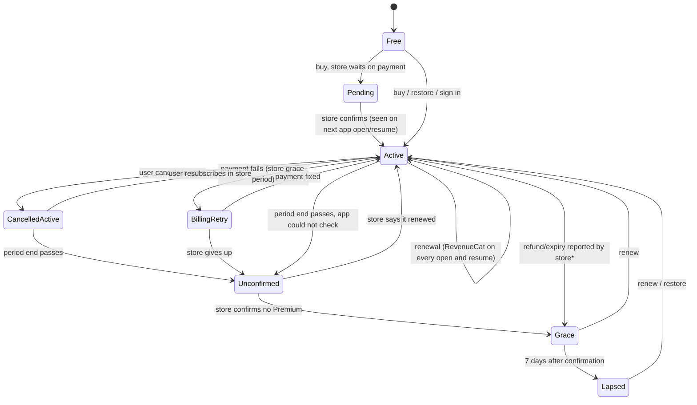

\* Refunds: see Decision 1.

| State | What the user has |
|---|---|
| **Active** (incl. cancelled-but-active and billing retry) | Everything. The account screen now says "Renews on …", "Cancelled. Premium stays on until …", or "The store could not take the last payment. Update your payment method…". |
| **Unconfirmed** (new) | Treated as grace. Nothing is deleted while the app can't confirm the end. |
| **Grace** (7 days from *confirmation*) | Routines, steps and 21-day history stay. Backup uploads stop. Voice-prompt recording, extra photos, wallpapers and completion emails are off. A dated warning appears on Home and the account screen. |
| **Lapsed** | Free limits apply: 2 routines (you choose which), 10 steps each, the last 48 hours of history shown (older history stays hidden on the phone until it is 21 days old), and 1 photo per step. Nothing else is deleted. |

Where this lives in the code:

- `lib/features/subscription/domain/subscription_lifecycle.dart`
- `SubscriptionAccountController` in `providers/subscription_provider.dart`
- `syncPurchasesSilently` in `data/revenuecat_purchase_repository.dart`

## Buying journey

**Ways into the paywall.** All of them push `/premium?source=…`:

- the free routine and step limit sheets (`subscription_guard.dart`);
- a locked step in the player (`routine_player_screen.dart:704`);
- the photo limit (`:697`);
- voice tip (`routine_composer_screen.dart:784, 813`);
- locked theme (`appearance_screen.dart:1126`);
- completion email (`routine_reminders_screen.dart:1879`);
- backup (`styled_history_screen.dart:1436`, `routine_list_screen.dart:222`);
- the account upgrade card and Renew (`account_hub_screen.dart`);
- the locked-routine screen (`main.dart`).

**Paywall states** (`pebble_paywall.dart`, `PaywallStoreState`):

- **Loading:** "Checking the store…".
- **Ready:** shows the prices.
- **Unavailable:** shows "Prices unavailable" with a **Try again** button.
- **Slow store:** after 12 seconds, a slow store also counts as unavailable, so the spinner never sticks.
- **Purchase in progress:** the Buy and Restore buttons are disabled with `_busy`, so a double tap can't start two purchases.

| Case | What happens | Verdict |
|---|---|---|
| Success, signed out | Premium unlocks on the phone straight away. An optional sign-in sheet appears ("Optional: sign in to back it all up"), then the user goes to Your account. Sign-in returns to Your account, so there is no loop. | OK. The headline used to say "One last thing to unlock it all", which suggested sign-in was required. Fixed. |
| Success, signed in | Waits up to 15 seconds for the server copy of the entitlement. Then it offers to turn on backup with one tap, or confirms backup is on if consent already exists. | OK |
| Pending payment (Play slow card, Ask to Buy) | Was an error notice: "Purchase not completed". **Now** it shows "Payment pending: Premium unlocks when the store confirms it, so there is no need to buy again." | Fixed. The unlock arrives on the next app open or resume (see Decision 5). |
| Cancelled | Closes silently. | OK |
| Already owned | Runs a restore. | OK. Edge case: if the store says "owned" but RevenueCat finds nothing, the user sees "No active Personal Premium purchase was found". This is rare and harmless. |
| Store error | Shows a plain message for each RevenueCat error code. | OK |

| Pending payment | Signed-out purchase | Cancelled, still active | Billing problem | Delete account |
|---|---|---|---|---|
| 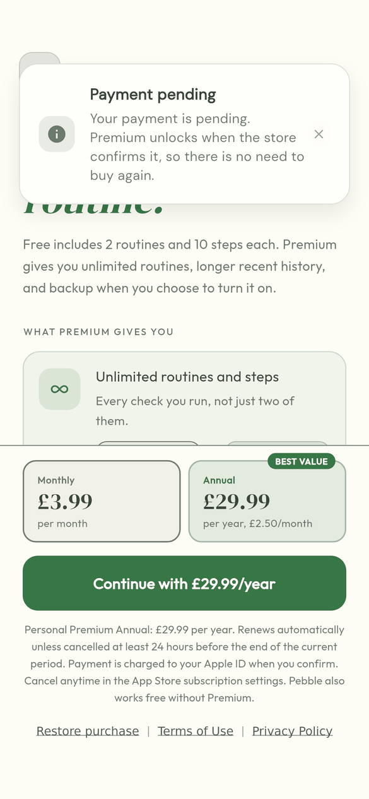 | 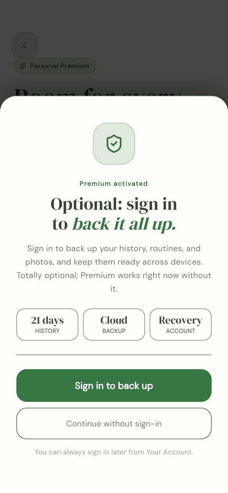 | 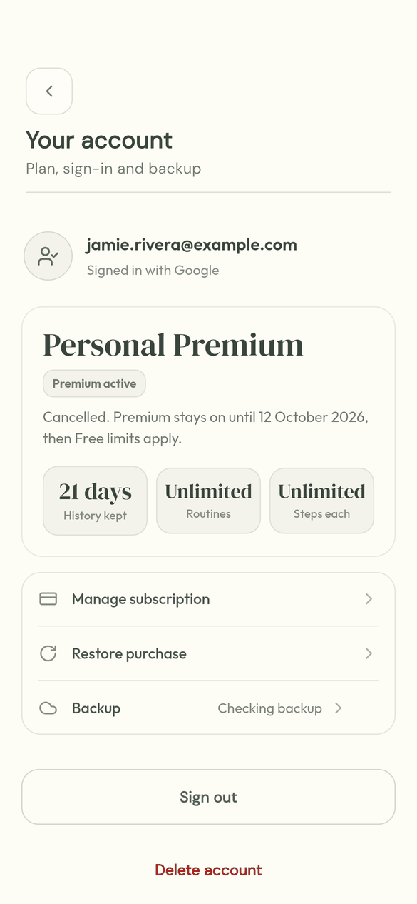 | 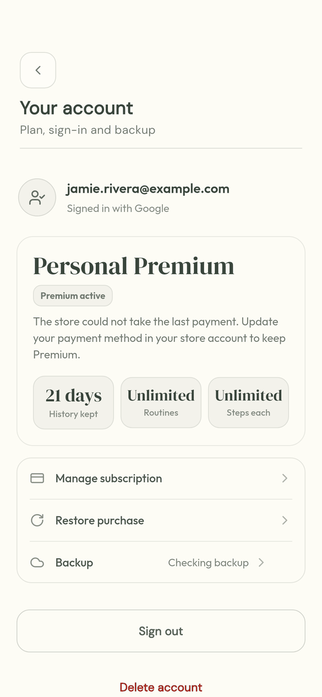 | 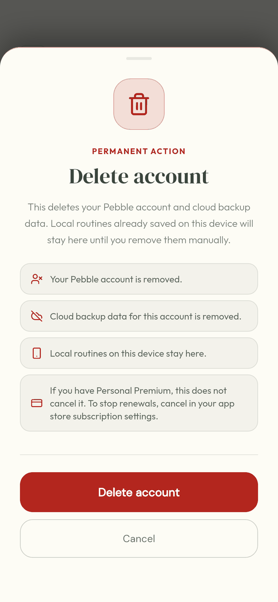 |

**Double-charge risk: none found.** The store won't sell the same subscription twice, and "already owned" goes to restore.

## What Premium unlocks, and where each check lives

| Feature | Free | Premium | Check |
|---|---|---|---|
| Routines | 2 | Unlimited | `SubscriptionGuard.canCreateRoutine` (create and duplicate). Locked routines: `restrictedRoutineIdsProvider` (home list, play button, `/play/:id` in `main.dart`). |
| Steps | 10 per routine | Unlimited | `SubscriptionGuard.canAddStep`. In the player: `RoutineLimitPolicy.isStepRestricted`. |
| Photos per step | 1 | 4 | `player_state_provider.dart:818` |
| History shown | 48 hours (21 days kept, the rest hidden) | 21 days | Shown: `accountHistoryRetentionProvider` → `routineHistoryVmProvider`. Kept on every plan: `ProofMediaFairUsePolicy.storedHistoryRetention` → `RoutineRunRepository.enforceRetentionPolicy`, plus photo files in `CloudSyncCoordinator.kick` |
| Voice prompts | Can't record | Record | `canUseGuidanceAudio` (composer). **Playback is never blocked.** |
| Themes and wallpapers | Basic | All | `canUsePremiumThemes` |
| Backup | Off | Needs sign-in and a choice to turn it on | `canUseCloudBackup` + RLS (`has_active_personal_entitlement`) |
| Completion emails | Off | Needs sign-in | `canUseSharedAlerts`, plus server checks |

The checks are consistent: every gate reads one `premiumFeaturePolicyProvider`.

## What happens when Premium lapses

| Thing | Before my changes | After |
|---|---|---|
| **History older than 48 hours** (8 Oct 2026: now hidden at grace end, not deleted; every plan keeps 21 days on the phone) | Deleted from the phone 7 days after the *period end*. A user who first opened the app later than that lost it at once, with no warning. A renewing subscriber who hadn't opened the app for a week could lose it too (bug). The screen said it was "locked". | Deleted from the phone 7 days after the store **confirms** the end, so the user always gets 7 days' notice. Home and the account screen show the count and the date ("3 completed routines older than 48 hours will be removed from this phone on 8 October. Renew to keep them."). Nothing is ever deleted on a guess. |
| **Photos in backup** | Deleted from the cloud at the same moment. | Only this phone's copy is removed. The cloud copy is left for the normal 21-day server cleanup. |
| **History in backup** | Kept indefinitely; never deleted by lapse. | Unchanged. On renewal and sign-in, the restore merges it back. The copy now says so. |
| **Routines beyond 2** | Locked. The 2 unlocked were always "pinned, then newest". Tapping a locked one went straight to the paywall. | Locked, but **the user chooses which 2 stay unlocked** (saved on this phone). Tapping a locked routine opens a sheet with Renew Premium and "Choose 2 routines to keep". "Nothing is deleted" is stated on every lock screen. |
| **Steps beyond 10** | Locked in the player with a banner. Saved, not deleted. | Unchanged |
| **Extra photos** | Existing photos kept. New steps allow 1. | Unchanged |
| **Voice prompts** | Still play. Recording new ones needs Premium. | Unchanged |
| **Wallpaper** | Saved choice wiped at lapse. | Hidden while lapsed. Comes back on renewal. |
| **Premium colour themes** | Stay applied. | Unchanged (see Decision 2) |
| **Backup** | Uploads stop. Cloud data kept. | Unchanged. Restorable on renewal and sign-in. |
| **Completion email contacts** | Server stops sending. Contacts kept. | Unchanged (not my area) |
| **Account screen** | Replaced by a "Premium has ended" page with no sign in, sign out, restore, backup or delete. | The same lapse summary (with dates and "Choose 2 routines to keep"), followed by the normal account rows. |

Before and after: the old screen ended at Manage subscription. The new one keeps the full account rows.

| Before (signed out, lapsed) | After: grace, signed in | After: account rows kept |
|---|---|---|
| 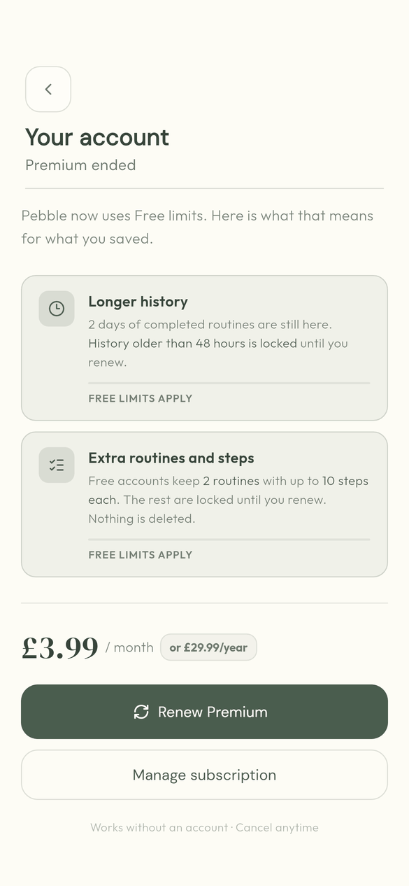 | 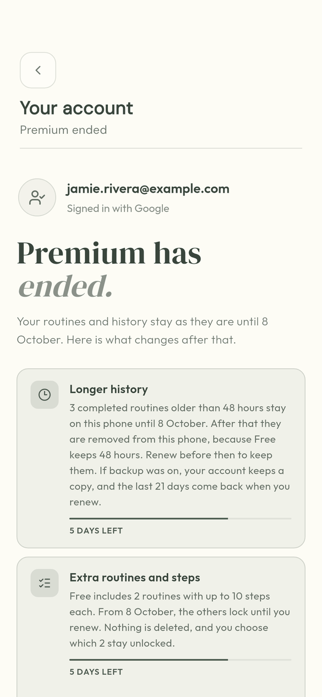 | 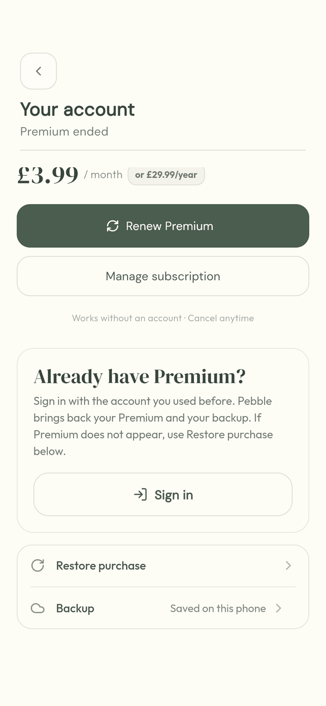 |

| Home during grace | Locked routines | Tap a locked routine | Choose which stay |
|---|---|---|---|
| 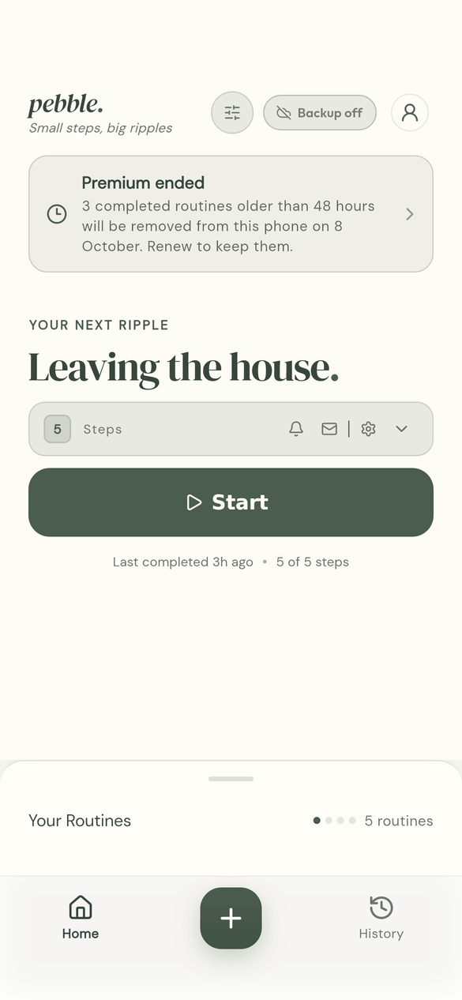 | 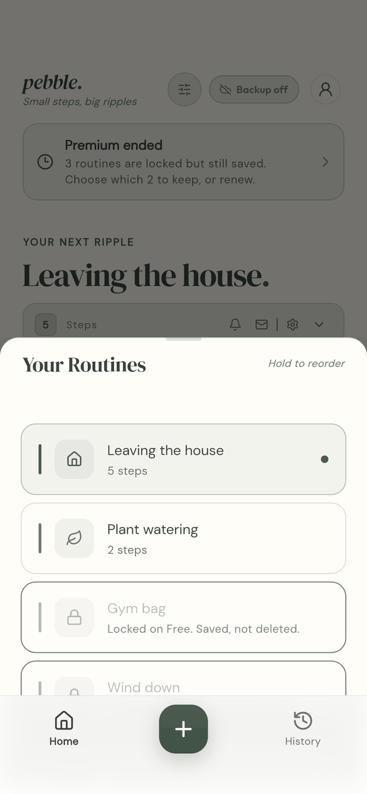 | 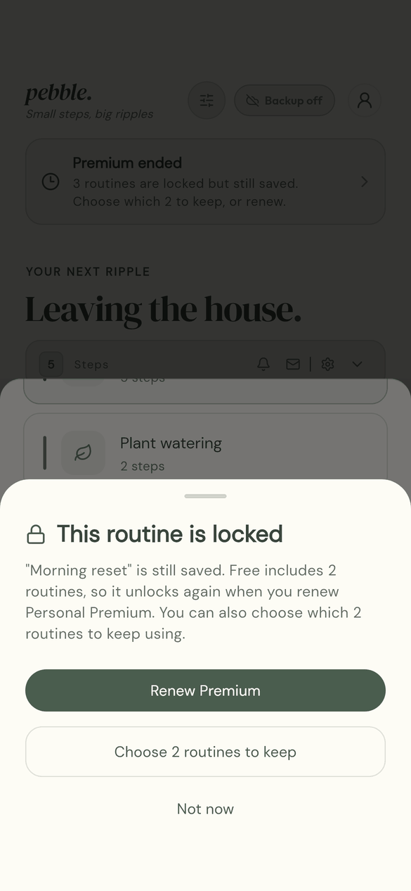 | 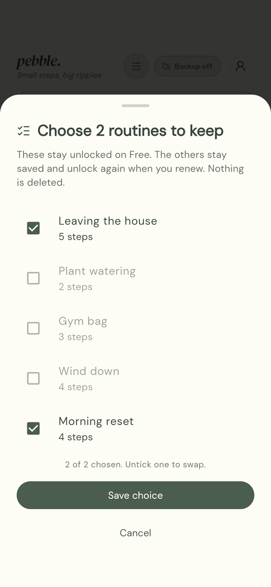 |

Opening a locked routine directly (from a reminder or widget) shows: 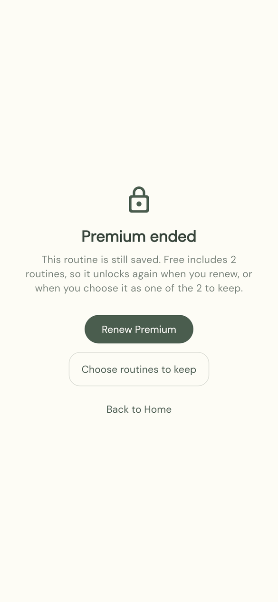

## Renewal, billing retry, grace, cancellation, refund and expiry

**How the app finds out.**

- `syncPurchasesSilently` (RevenueCat `getCustomerInfo`) runs on launch, on every resume and after sign-in.
- The server copy (`revenuecat-webhook` and `revenuecat-sync-entitlement` → `personal_entitlements`) is read after each sync, for backup and completion emails.
- The RevenueCat listener only records the "Manage subscription" link. It is now also read from every fetched result, so a Play purchase opened on an iPhone links to Play.

**Each event:**

- **Renewal:** the period end moves forward on the next open.
- **Billing retry / store grace:** RevenueCat keeps the entitlement active. Pebble now shows the payment-problem line. The webhook maps `BILLING_ISSUE` to `grace`.
- **Cancellation:** stays active until the period end. The account screen now says "Cancelled. Premium stays on until 12 October 2026, then Free limits apply."
- **Expiry:** the store reports no entitlement. The lapse is confirmed and grace starts.
- **Offline:** the cached period end is trusted until it passes. After that, nothing destructive happens until the store confirms the end.
- **Clock changes:**
  - Setting the clock back keeps cached Premium on the phone until the next online check. RevenueCat then decides.
  - Setting it forward can't delete anything, because deletion needs a confirmed lapse.
- **Cached entitlement trust:** in production, stored Premium that isn't store-verified is reset to Free at load (existing behaviour).
- **Refund or revoke:** see Decision 1.

## Cross-device and account cases

| Case | Behaviour |
|---|---|
| Bought on Android, then iPhone with the same account | Sign in → RevenueCat `logIn(userId)` → entitlement active. Manage subscription opens Google Play. Restore on the iPhone isn't needed. |
| Bought signed out, then signed in (Android) | The silent restore after sign-in moves the purchase to the account (the tested Android path, unchanged). |
| Bought signed out, then signed in to an *existing* account (iPhone) | No silent restore on iOS (by design: it can raise the Apple ID prompt). Premium stays on the phone. Backup waits until the user taps **Restore purchase**. See Decision 6. |
| New phone | Sign in, or tap Restore. Both are on the paywall and in Your account, including after a lapse now. |
| Delete account with active Premium | The sheet now says: "If you have Personal Premium, this does not cancel it. To stop renewals, cancel in your app store subscription settings." Premium stays on the phone, tied to the store account. |

## Store-policy check

| Rule | Status |
|---|---|
| Apple 3.1.2 and Google Play: price, length and renewal terms next to the Buy button | ✅ Fine print under the button, worded for each store |
| Restore purchase available | ✅ On the paywall and in Your account. Now also after a lapse. |
| Manage or cancel link | ✅ "Manage subscription" uses RevenueCat's link to the store that sold the plan |
| No misleading free trial | ✅ There is no trial in the code or the copy |
| Terms and Privacy links on the paywall | ✅ |
| Account deletion findable (Apple 5.1.1(v)) | ✅ Now always in Your account. Previously hidden after a lapse. |
| Deleting the account doesn't cancel the subscription: user told | ✅ Added |
| Cancellation instructions | ✅ In the paywall fine print and `web/terms.html` |
| Terms match behaviour | ✅ `web/terms.html` now describes when grace starts, that history is removed and routines are locked (not deleted), and the choose-which-to-keep option |

## What I fixed

- **Commit `038d140`: history is only removed after a confirmed lapse.**
  - New `entitlementLapseNoticedAt` field (set only when the store or server says Premium ended).
  - Grace now runs from that confirmation.
  - `whenLoaded` guard so retention can't run on the Free default before the stored plan loads. A test shows it fails without the guard.
  - Retention clears the phone only, not the cloud.
  - Renewal and billing details are stored.
  - New "Payment pending" notice.
  - Wallpaper choice kept through a lapse.
  - Optional-sign-in headline.
- **Commit `6d4d7b3`: a kinder lapse.**
  - Choose which routines to keep (`kept_routines_provider.dart`, `premium_lapse_ui.dart`).
  - Dated Home card (`premium_lapse_provider.dart`).
  - Account screen keeps all its rows after a lapse.
  - Honest copy.
  - Renew always tappable.
  - Delete-account subscription note.
- **Commit `80c1084`:** walkthrough states for pending, signed-out purchase, cancelled, billing issue, grace, lapsed with 5 routines, the lock sheets, the locked player, resubscribe and delete.
- **Terms:** lapse paragraph updated.
- **New tests:**
  - lifecycle state machine and controller bookkeeping (`subscription_lifecycle_test.dart`);
  - start-up retention race and unconfirmed or confirmed lapse (`routine_run_repository_test.dart`);
  - choosing kept routines (`routine_limit_policy_test.dart`);
  - lapse summary, renewal lines and the keep-routines sheet (`premium_lapse_test.dart`);
  - lapsed account screen and delete sheet (`account_backup_state_test.dart`).
- **Backend:** no change was needed. The webhook's status mapping (cancelled_active, grace, expired) and migration 017 are correct for this flow.

**Android call sequence.** The only addition to `syncPurchasesSilently` is a local bookkeeping call (`confirmLapseIfExpired`) in the existing "no entitlement" branch. The Android purchase, restore and `logIn` calls happen in the same order as before.

## Decisions for you

1. **Refunds keep Premium on the phone until the cached period end.** For a yearly plan, that can be months. The app deliberately keeps local Premium while RevenueCat shows none, to cover account switching.
   - *Recommendation:* accept this for launch. Refunds are rare, you approve them yourself in Play Console, and changing it touches the tested Android sync.
   - Revisit after launch by treating "entitlement present but inactive" from RevenueCat as final, with a fresh Android test pass.
2. **Grace covers routines and history only.** Voice-prompt recording, extra photos and wallpapers switch off as soon as the lapse is confirmed. Premium colour themes stay applied.
   - *Recommendation:* keep. Nothing is lost. Existing voice prompts still play and existing photos stay.
3. **Which 2 routines stay unlocked if the user doesn't choose:** currently "pinned, then newest".
   - *Recommendation:* keep for now. Users can now choose. A later improvement would default to the two most recently completed.
4. **Grace length: 7 days.** It matches the terms. *Recommendation:* keep.
5. **A pending payment that completes while the app is open** unlocks on the next open or resume, not instantly.
   - *Recommendation:* keep. Users normally come back from a store notification, which triggers the check. Changing it would add a new Android purchase path.
6. **iPhone: bought while signed out, then signed in to an existing account.** Backup waits for the user to tap Restore, and the message ("waiting for secure purchase verification") is vague.
   - *Recommendation:* before the iOS launch, change that message to "Tap Restore purchase to link Premium to this account."
7. **Offline after a lapse:** a phone that never reconnects stays in grace indefinitely (lenient). *Recommendation:* accept.

## What must be tested on a real phone

**Setup, Android:**

- Play Console → Settings → **License testing**: add your tester Google accounts.
- Test subscriptions renew every 5 minutes for monthly plans (up to 6 renewals), then end.
- Use the test cards: "always approves", "always declines", "Slow test card, approves after a few minutes" and "Slow test card, declines after a few minutes".

**Setup, iOS:**

- App Store Connect → Users and Access → **Sandbox testers**.
- On the iPhone: Settings → App Store → Sandbox Account.
- Sandbox monthly plans renew every 5 minutes, up to 12 times.

Keep the RevenueCat dashboard open (Customers → the tester) to see each event.

1. **Buy signed out (Android).**
   - Install fresh and make 3 routines; the 3rd is blocked.
   - Open the paywall and buy Monthly with "always approves".
   - *Expect:* "Premium activated, Optional: sign in" → Continue without sign-in → Your account shows Personal Premium. You can now add a 3rd routine.
2. **Sign in after buying.** Your account → Sign in. *Expect:* Premium stays. Turning on backup works. The server row in Supabase `personal_entitlements` is `active`.
3. **Pending payment.**
   - Use a second tester and buy with "Slow test card, approves after a few minutes".
   - *Expect:* "Payment pending". Don't buy again.
   - Wait 3–5 minutes, background the app, then reopen it. *Expect:* Premium is on.
   - Repeat with "declines after a few minutes". *Expect:* Premium never turns on, and there is no crash.
4. **Renewal.** Stay subscribed past 5 minutes, then reopen the app. *Expect:* Your account shows "Renews on …" with a time a few minutes later.
5. **Cancel.** Play Store → Subscriptions → Cancel. Reopen Pebble. *Expect:* "Cancelled. Premium stays on until …", and Premium still works.
6. **Lapse and grace.**
   - Wait for the cancelled plan to end, then reopen.
   - *Expect:* the Home card "Premium ended … will be removed from this phone on [date 7 days later]", and the account screen shows the dates.
   - Sign out and Delete account must still be visible.
7. **Choose routines.**
   - With 5 routines, open Home → Your Routines. During grace, nothing is locked yet.
   - To test the lock without waiting 7 days, do a fresh install of a debug build, or ask Claude for a debug switch.
   - *Expect:* 3 are locked. Tapping one shows the lock sheet. "Choose 2 routines to keep" swaps which are unlocked. Locked routines are still listed.
8. **Resubscribe.** Renew Premium from Your account. *Expect:* everything unlocks. Signed in with backup on, older history returns after the restore finishes.
9. **Billing problem (Android).**
   - Subscribe with "always approves". In Play Store → Subscriptions → Fix payment / change the method to "always declines", then wait for the renewal.
   - *Expect:* "The store could not take the last payment…" while Play's grace period lasts, then a lapse.
10. **Refund.** Play Console → Order management → Refund (with and without revoke). Note what Pebble shows (Decision 1).
11. **Bought on Android, then iPhone.**
    - Sign in on the iPhone with the same Pebble account.
    - *Expect:* Premium is on without Restore. Manage subscription opens Google Play.
12. **iPhone.**
    - Sandbox buy, then delete and reinstall, then Restore purchase. *Expect:* Premium returns.
    - Test Ask to Buy in Xcode's StoreKit testing or with a sandbox "interrupted purchase". *Expect:* "Payment pending".
13. **Delete account with active Premium.** *Expect:* the sheet says this doesn't cancel Personal Premium. After deletion, Premium stays on the phone. Cancel in the store separately.
14. **Offline renewal (the fixed bug).**
    - Subscribe and complete a routine. Turn on airplane mode, let 2–3 renewal periods pass (15 minutes), then force-close and reopen while still offline.
    - *Expect:* history is still there. Go back online and reopen. *Expect:* Premium is active and history is intact.

Full screenshots are in the session scratchpad at `subscription_review/after/`. A curated set is in `docs/review/subscription/`.
